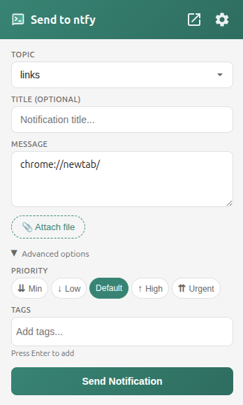
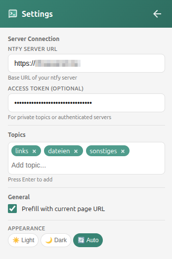
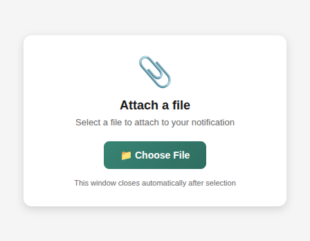

# Send to ntfy

[](https://github.com/TheDuffman85/send_to_ntfy_extension/actions/workflows/build.yml)

A browser extension to send the notifications to [ntfy.sh](https://ntfy.sh) or your self-hosted ntfy server.

## Features

- **File Upload**: Easily upload and send files to your ntfy topics.
- **Quick Sharing**: Send the current page URL or custom text to your ntfy topics.
- **Custom Configuration**: Support for self-hosted ntfy servers.
- **Authentication**: Optional support for token-based authentication.
- **Privacy First**: No tracking, just simple functionality.
- **Modern UI**: Clean interface with Dark Mode support.
- **Cross-Browser**: Supports Chrome, Firefox, and Edge (Manifest V3).

## Installation

### Official Stores

| Browser | Store Link |
| :--- | :--- |
| **Firefox** | [](https://addons.mozilla.org/de/firefox/addon/send-to-ntfy/) |
| **Chrome** | [](https://chromewebstore.google.com/detail/send-to-ntfy/kfiegffaamihidajjcingmognibehdlb) |
| **Edge** | [](https://microsoftedge.microsoft.com/addons/detail/send-to-ntfy/nlcjgpmaicbjkjdicgiaighhlihfhafj) |

### Manual Installation
1. Download the latest release from the [Releases page](https://github.com/TheDuffman85/send_to_ntfy_extension/releases).
2. Unzip the file.
3. Load the unpacked extension in your browser's developer mode.

## Configuration & Usage

Access the extension settings to configure your preferences:

1. **ntfy Server**: Default is `https://ntfy.sh`, but you can change this to your self-hosted instance.
2. **Topic**: Set your default target topic.
3. **Authentication**: If your server requires it, enter your Access Token.
4. **Priorities**: Choose a default priority level or adjust it per message.
5. **Tags**: Add tags to your notifications for better organization.

## Development

To build the extension locally:

```bash
# Build for all browsers (Chrome, Firefox, Edge)
./build.sh

# Or build for a specific browser
./build.sh chrome
./build.sh firefox
./build.sh edge
```

The build output will be placed in the `build/` directory.

## Screenshots

<p align="left">
  <br><br>
  <br><br>
  
</p>
